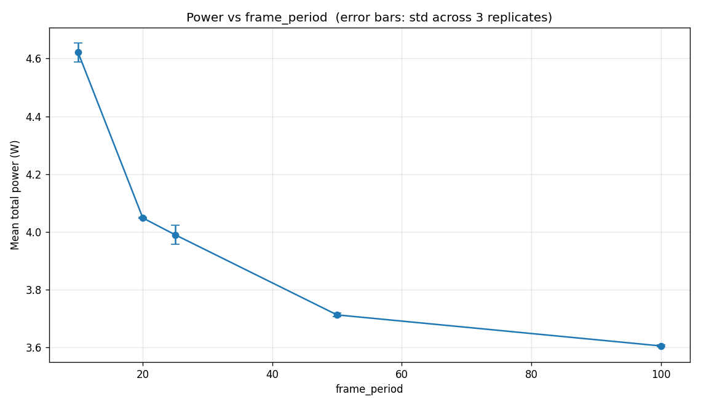
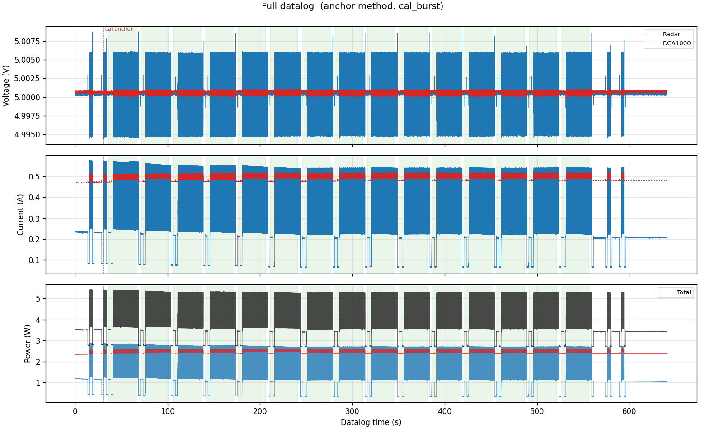
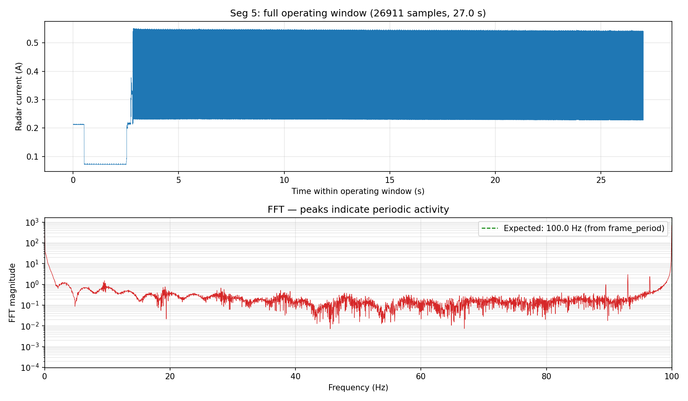

# pa_xwr — Automated Radar Power Studies

Run reproducible **power-consumption studies** on TI mmWave radars. A YAML
sweep spec drives the radar through a grid of chirp parameters while a
Keysight N6705B DC power analyzer records voltage and current. Offline
analysis then segments the datalog, computes per-point statistics, and
writes plots you can drop into a paper or lab notebook.

Radar capture uses the [xwr](https://github.com/RadarML/xwr) library (Linux + DCA1000EVM). This repo is the experiment harness around it: sweep
planning, time-sync, analysis, and device templates.

Anyone with compatible hardware can clone this repository, pick or write a
sweep spec, and measure how frame rate, frame length, or other chirp
parameters change for radar + capture-card power.

## What you need

| Role | Hardware / software |
|---|---|
| Capture (the sweep itself) | Linux PC, TI mmWave EVM, [DCA1000EVM](https://www.ti.com/tool/DCA1000EVM), Keysight N6705B (2 channels), [`uv`](https://github.com/astral-sh/uv) |
| Analysis only | Any OS with Python 3.11+ — point `rps-analyze` at an existing study folder |

### Compatible radars

`xwr` currently supports:

- **AWR1843 family** — AWR1843Boost, AWR1843AOPEVM *(template included: `devices/AWR1843.yaml`)*
- **AWR1642Boost**
- **AWR2944EVM**
- **AWRL6844EVM**

This repo ships an AWR1843 device template. To study another xwr-supported
radar, add `devices/<DeviceName>.yaml` with that board's RF defaults (copy
`devices/AWR1843.yaml` and edit). Then set `device: <DeviceName>` in your
sweep spec, or pass `--device <DeviceName>` on the command line.

See [xwr's supported-device list](https://github.com/RadarML/xwr) — if xwr
gains a new radar, this harness can drive it as soon as you add a template.

## Install

```bash
git clone https://github.com/cbill-cmu/pa_xwr.git
cd pa_xwr
uv sync
```

That installs this package plus [xwr](https://github.com/RadarML/xwr) from
GitHub. To use a **local** xwr checkout instead (for example if you are
developing both repos), edit `pyproject.toml`:

```toml
[tool.uv.sources]
xwr = { path = "../xwr", editable = true }
```

Then run `uv sync` again. Capture still requires Linux and the DCA1000
network/UART setup described in [PROTOCOL.md](PROTOCOL.md).

## Quickstart

```bash
# Dry-run a sweep (no hardware). Confirms the spec, duration, and study folder.
uv run rps-sweep --spec sweeps/frame_period_sweep.yaml --dry-run --replicates 1

# Real sweep against hardware (see PROTOCOL.md for the bench procedure)
uv run rps-sweep --spec sweeps/frame_period_sweep.yaml

# After you copy the N6705B CSV to studies/<run>/raw/datalog.csv:
uv run rps-analyze studies/<generated-folder-name>/

# Optional: check that a segment really chirped at the configured frame rate
uv run rps-fft-zoom studies/<generated-folder-name>/ 5
```

Read [PROTOCOL.md](PROTOCOL.md) for the full bench procedure (cabling, N6705B
datalog, synchronized start). Read [DESIGN.md](DESIGN.md) for architecture.

Included sweep specs:

| Spec | What it varies |
|---|---|
| `sweeps/frame_period_sweep.yaml` | 1-D: `frame_period` (10–100 fps) |
| `sweeps/low_frame_rate_x_frame_length.yaml` | Multi-line: `frame_period` at `frame_length` 64 and 128 |
| `sweeps/constant_frame_length_x_frame_rate.yaml` | High frame-rate `frame_period` sweep at `frame_length` 4 |

Copy one of those files, change `study_name` / `device` / `values`, and you
have a new experiment.

## Example results

Full study folders (raw datalogs, configs, plots, and summary tables) from
AWR1843 bench runs are here:

**[Example results (Google Drive)](https://drive.google.com/drive/folders/1Gqs9I2LefKKor8hbqKdpcNKFs5eaXo2U?usp=drive_link)**

Included runs:

- `2026-06-09_AWR1843_frame_period_sweep_2`
- `2026-06-10_AWR1843_constant_frame_length_x_frame_rate`
- `2026-06-10_AWR1843_constant_frame_length_x_frame_rate_FAST`
- `2026-06-10_AWR1843_low_frame_rate_x_frame_length`

The plots below are from the frame-period sweep (AWR1843, 3 replicates).
Shorter `frame_period` (higher frame rate) uses more power:



The full N6705B datalog, with calibration bursts at both ends and shaded
operating segments in the middle:



FFT of radar current for one segment, used to confirm the configured frame
rate (here 100 Hz):



## Adding a radar

1. Copy `devices/AWR1843.yaml` to `devices/<XwrDeviceName>.yaml`.
2. Set `radar.device` to the name xwr expects (`AWR1642`, `AWR2944`,
   `AWRL6844`, … — see [xwr radar API](https://radarml.github.io/xwr/radar/api/)).
3. Fill in that board's frequency band, chirp timings, ADC, and frame
   defaults. Keep `frame_length` and `adc_samples` as powers of 2.
4. Point a sweep spec at it: `device: <XwrDeviceName>`.

`rps-sweep` validates every (primary × secondary × replicate) config
**before** the datalog starts. Invalid combinations abort with a clear
error instead of wasting a long capture.

## Repository structure

```
pa_xwr/
├── pyproject.toml
├── README.md                       this file
├── PROTOCOL.md                     lab / bench procedure
├── DESIGN.md                       architecture
├── LICENSE
│
├── src/pa_xwr/
│   ├── sweep.py                    orchestrator (`rps-sweep`)
│   ├── capture.py                  one-segment radar driver
│   ├── analyze.py                  offline analysis + plots (`rps-analyze`)
│   └── FFT_zoom.py                 frame-rate check via current FFT (`rps-fft-zoom`)
│
├── devices/                        one YAML template per radar family
│   └── AWR1843.yaml
│
├── sweeps/                         experiment specifications (edit these)
│   ├── frame_period_sweep.yaml
│   ├── low_frame_rate_x_frame_length.yaml
│   └── constant_frame_length_x_frame_rate.yaml
│
├── docs/images/                    README example plots
└── studies/                        gitignored; each run writes a folder here
```

Each study folder is self-contained: the sweep spec, device template,
segment log, raw datalog, plots, and a generated `results/README.md`.

## License

MIT. See [LICENSE](LICENSE).
